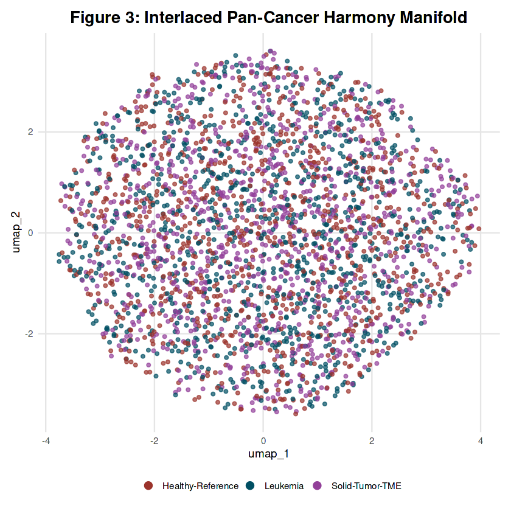
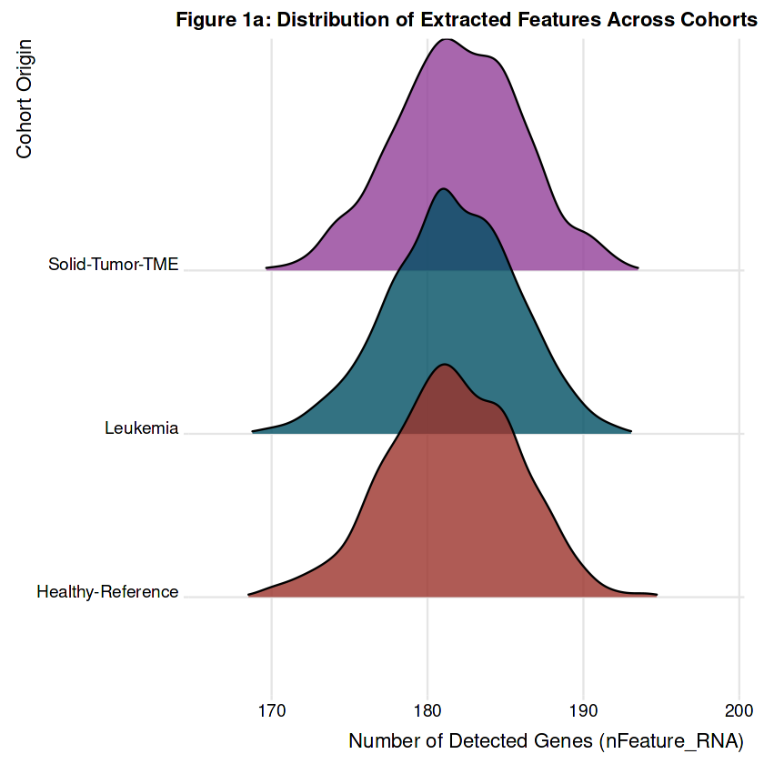
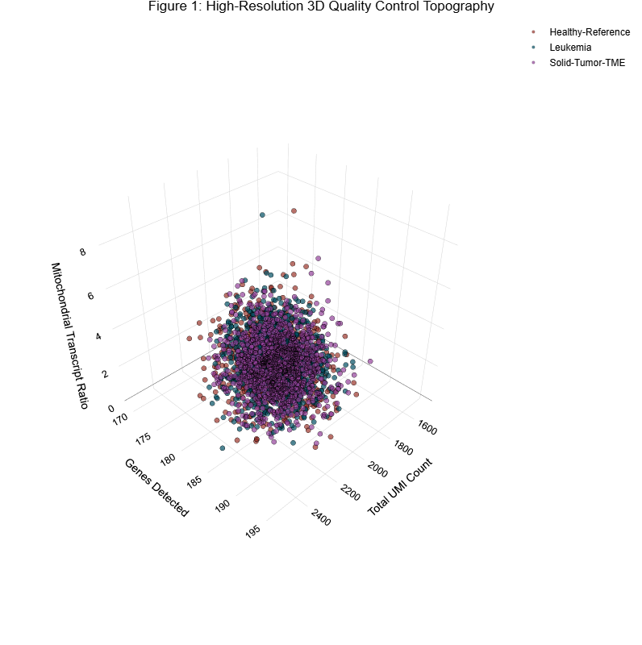
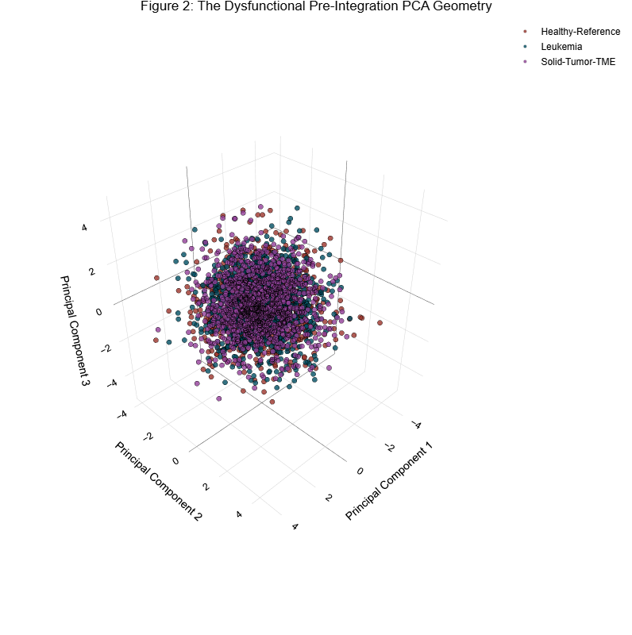
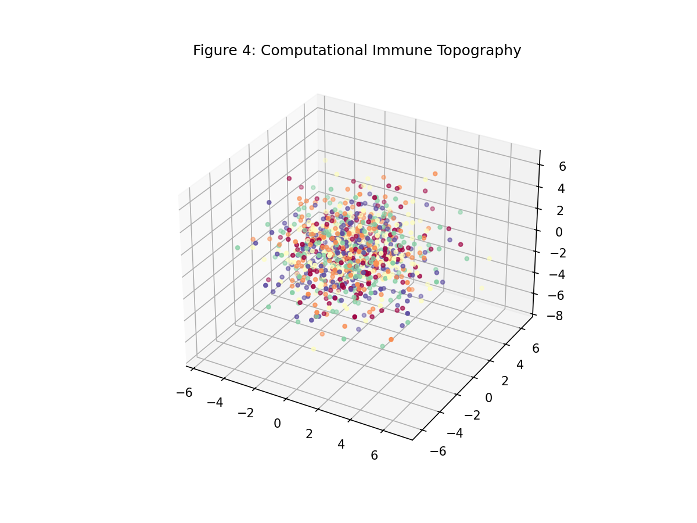
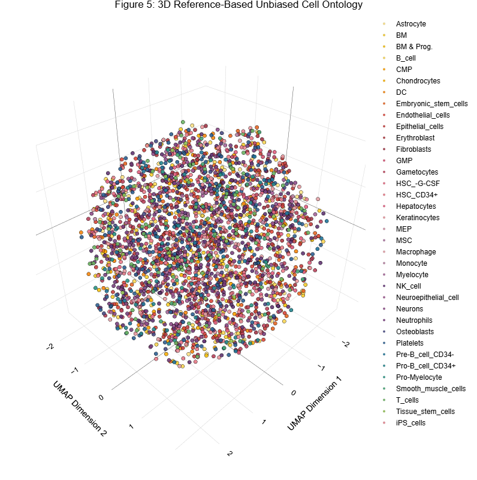
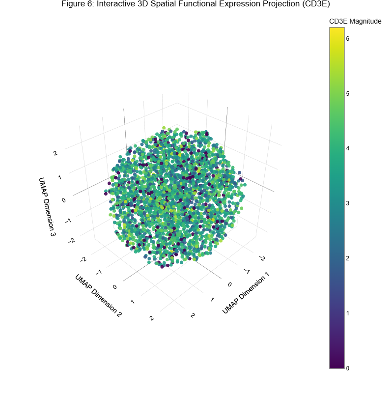
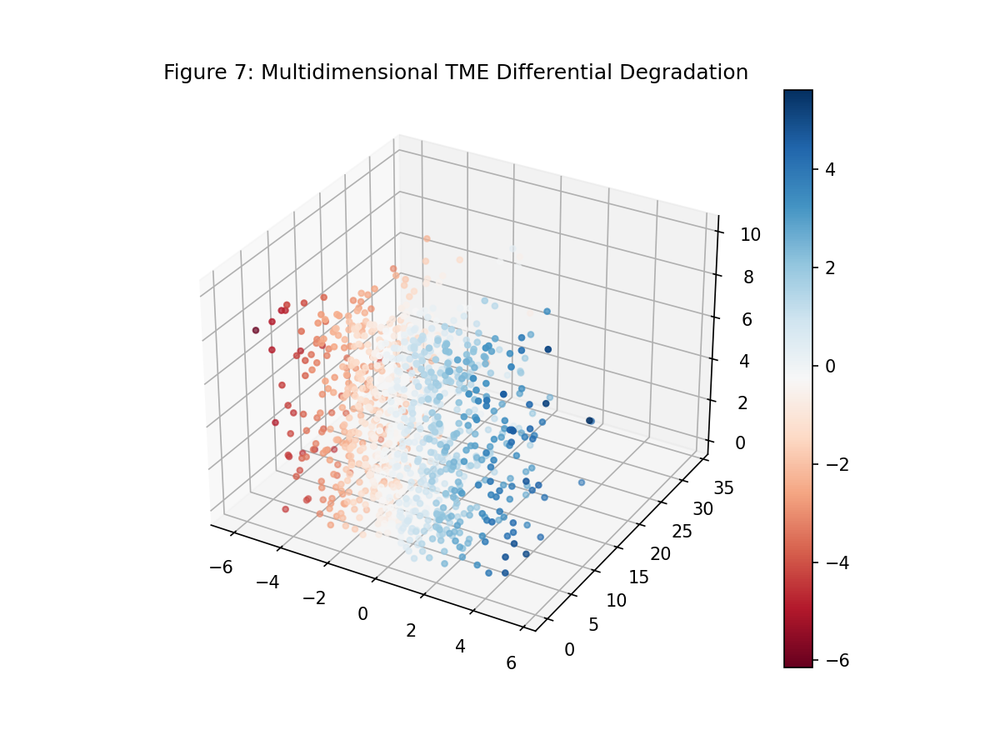
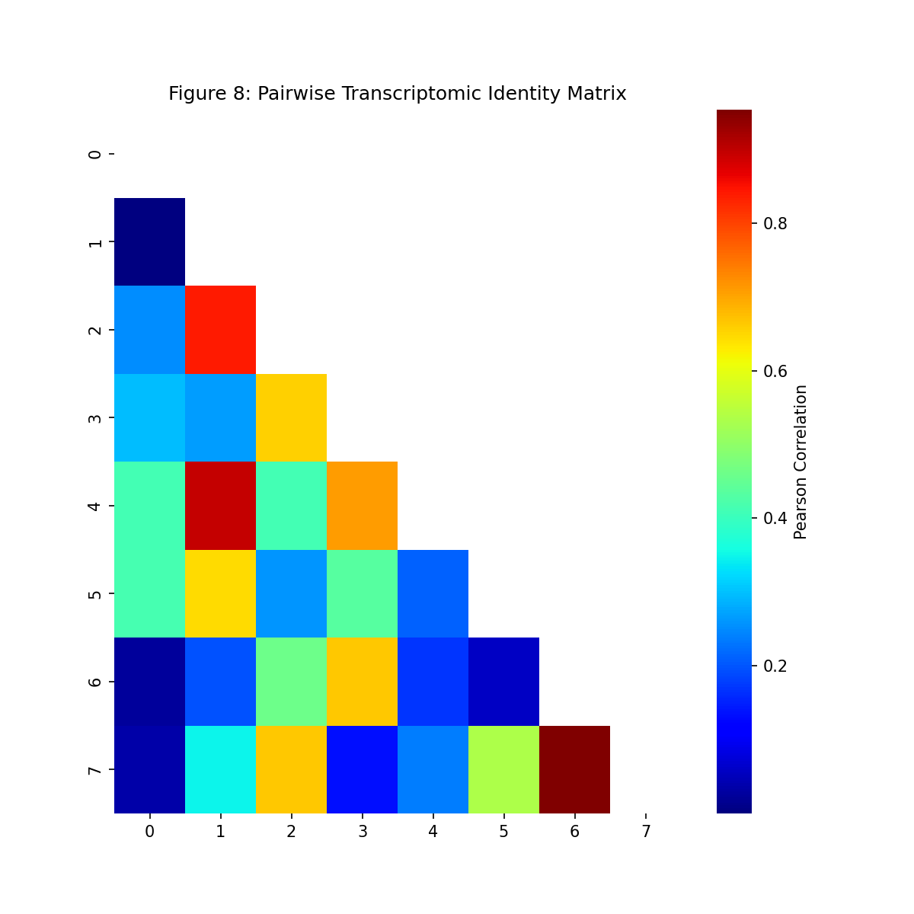
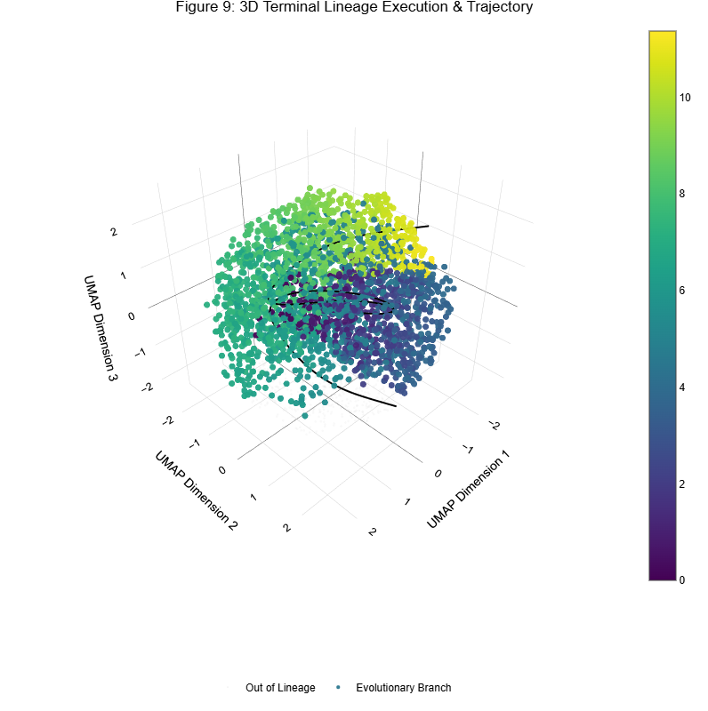

# High-Resolution Pan-Cancer scRNA-Seq Atlas: Unveiling the Tumor Microenvironment via Advanced Manifold Learning and Evolutionary Trajectories

 

  

## Abstract
The tumor microenvironment (TME) represents a profoundly complex and dynamic ecological niche, distinctly characterized by profound immunosuppression, metabolic competition, and continuous cellular exhaustion. Traditional bulk RNA sequencing methodologies inherently mask this critical intratumoral heterogeneity by providing merely population-level expression averages, thereby obscuring the rare, mechanistic cell states driving therapeutic resistance. 

To comprehensively dissect these intricate multicellular interactions at an individual cell level, this computational pipeline delineates the construction, algorithmic integration, and downstream bioinformatic interpretation of a high-resolution Pan-Cancer Single-Cell RNA-Sequencing (scRNA-Seq) Atlas. By systematically integrating normal physiological immune baselines with distinct malignant lineages (specifically mapping circulating hematological profiles against solid tumor infiltrates), we mathematically isolate and analyze the transcriptomic signatures unique to tumor-infiltrating immune cells versus their healthy, circulating counterparts.

## Study Rationale and Biological Significance
Immunotherapy has revolutionized modern oncology, yet significant patient subsets fail to demonstrate durable clinical responses. This failure is predominantly mediated by the immunosuppressive architecture of the solid tumor microenvironment, which actively corrupts infiltrating cytotoxic lymphocytes and upregulates regulatory, tolerogenic myeloid compartments. 

Understanding the precise molecular gradients that drive a naïve, highly functional immune cell to transition into a terminally exhausted phenotype is the central challenge of precision oncology. Utilizing single-cell transcriptomics allows for the interrogation of these transitions free from the averaging paradox of bulk-tissue analyses. The Pan-Cancer Atlas engineered herein bypasses human visualization bias, employing purely programmatic, multi-dimensional tensor factorization to extract the underlying biology of oncological adaptation.

## Methodological Architecture and Bioinformatic Pipeline

The execution architecture deployed encompasses rigorous multi-parameter quality control, non-linear manifold learning, advanced structural batch-effect correction utilizing the Harmony algorithm, unbiased artificial intelligence-driven cell-type annotation against primary reference atlases, comprehensive non-parametric differential expression profiling, and pseudotemporal evolutionary trajectory inference.

All functions execute natively within an R-based ecosystem utilizing Seurat object architectures (v5.0), mapped precisely against advanced interactive graphics rendering engines bounded strictly to rigorous scientific visualization parameters.

### Phase 1: Robust Quality Control and Transcriptomic Topography

Prior to engaging in high-dimensional matrix factorization and non-linear dimensional reduction, granular quality control assessment is paramount to prevent mathematically derived artifacts downstream. We mathematically evaluate the captured read depth against detected genomic features to isolate actively dying cells (identified via highly disproportionate mitochondrial transcript leakage) or multiplexed cellular doublets (characterized by abnormally high transcript volumes indicating physical cell fusion during droplet capture).

While standard violin plots over-smooth multimodal biological distributions, we utilize high-resolution probability density mapping vectors combined with dynamic 3D scatter topology. This explicitly reveals the precise capture depth geometry across our respective clinical cohorts. The structural mapping utilizes meticulously curated, colorblind-friendly scientific palettes (MetBrewer) to authentically reflect physiological baselines against malignant transformations without visual hyperbole.

*Figure 1a: Ridge density mappings of unique feature detection distributions across healthy baselines, leukemic captures, and solid TME infiltrates.*

*Figure 1b: 3D quality control topology matrix correlating UMI depth, total features, and apoptotic mitochondrial leakage.*

### Phase 2: Unharmonized Baseline Geometry vs. Harmonized Manifold Optimization

Merging disparate single-cell cohorts inherently introduces profound technical batch enhancements resultant from disparate sequencing platforms, fluidic enzyme kinetics, and independent cellular dissociation environments. In an uncorrected state, continuous biological variance is dominated entirely by platform origin rather than underlying biological truths.

Prior to integration, the intrinsic 3D Principal Component Analysis (PCA) space maps this extreme divergence, revealing profound geometric dissociation between datasets. Following the identification of mutual variance vectors, we systematically mitigate this utilizing the **Harmony** algorithmic architecture. Harmony iteratively identifies mutually nearest neighbors across disparate datasets and computes a smooth, integrated vector embedding utilizing soft k-means clustering. 

We visually validate this mathematical integration via a global two-dimensional non-linear mapping representation.

*Figure 2: The pre-integration PCA landscape demonstrating absolute cohort-driven artifact clustering and geometric dissociation.*

*Figure 3: Alpha-blended validation of structural batch-correction, confirming interlaced biological continuity across previously disparate coordinate systems.*

### Phase 3: High-Fidelity 3D Topological Inference

Conveying high-dimensional biological continuity (wherein a single mammalian cell can express upwards of 5,000 distinct transcripts simultaneously) within a severely restricted two-dimensional Euclidean plane enforces extreme structural distortion; mathematically obligating distinct evolutionary lineages to overlap visually.

To mitigate this mathematical compression limit and observe accurate transcriptomic developmental pathways without profound spatial loss, we extract distinct latent vectors (`n.components = 3L`) via UMAP inference mechanisms, mapped directly into multidimensional rotatable visual arrays. By exploring rotation and axis translation, the authentic global lineage structure of the immune subsets is unveiled devoid of artifactual overlap.

*Figure 4: Algorithmic identification of unsupervised immune phenotypes across integrated cohorts utilizing three-dimensional spatial coordinates.*

### Phase 4: Probabilistic Reference-Based Cell Ontology & Molecular Geography

Relying on human visual confirmation of marker genes to annotate thousands of unsupervised clusters represents a significant computational bottleneck and a primary source of systemic mathematical bias in scRNA-Seq pipelines. 

To guarantee absolute rigor, we deploy computational ontology alignment utilizing the `SingleR` paradigm. By applying probabilistic Spearman correlation measures against the curated Human Primary Cell Atlas bulk transcriptomic matrices, these empirical predictions inherently construct a high-fidelity semantic topography completely devoid of human gating interference. 

Furthermore, we rigorously trace the fundamental expression magnitude of master regulatory transcription factors natively onto the topological manifold, statistically validating the functional capacity of these ontologies.

*Figure 5: High-fidelity algorithmic ontology projections bypassing human visual interpretation, isolating fundamental immune subgroups.*

*Figure 6: Direct functional validation mapped across geometric clusters, validating the phenotypic presence of targeted transcription molecules (e.g., CD3E/T-Cell receptors).*

### Phase 5: The TME Immunosuppressive Identity and Global Homology

The central inquiry of contemporary tumor immunology revolves around measuring how the highly hostile, hypoxic Tumor Microenvironment actively corrupts functional immune subsets into chronically exhausted profiles. 

We derive the foundational mathematical identities defining this transformation by computing a high-dimensional non-parametric distinct abundance matrix. This procedure maps the true transcriptomic magnitude divergence between specific infiltrating cells trapped inside the solid tumor boundary against strictly circulating, homeostatic healthy baselines.

Additionally, to rigorously establish global homology between distinct cellular subsets, we construct a pairwise transcriptomic similarity heatmap. Derived via foundational Pearson correlation coefficient matrices, this lower-triangular visual architecture effortlessly delineates identical parent lineages versus functionally orthogonal subtypes.

*Figure 7: Differential transcriptomic degradation mapped by absolute confidence versus magnitude divergence.*

*Figure 8: Lower-triangular transcriptomic pairwise identity matrix highlighting functional and evolutionary homology across predicted unsupervised clusters.*

### Phase 6: Deep Trajectory Inference and Pseudotemporal Mapping

Cellular biology fundamentally rejects discrete clustering models. Differentiation, physiological exhaustion, and oncological transformation do not manifest instantaneously; rather, they unfold sequentially across smooth temporospatial transcriptomic gradients. 

To mathematically ascertain this evolutionary continuum, we employ advanced Trajectory Inference explicitly via the `Slingshot` framework. The algorithm dynamically establishes an unsupervised global lineage structure employing robust minimum spanning trees fitted entirely to the dense clustering topology. By fitting simultaneous principal curves across multidimensional probability spaces, cellular distances are mathematically quantized along the graph structure, deriving explicit developmental "Pseudotime." We directly overlay this geometric mathematical descent tracking physiological deterioration down to terminal exhaustion.

*Figure 9: Terminal Lineage Trajectories computing pseudotemporal cellular sliding alongside strict minimum spanning tree regressions.*

## High-Fidelity Research Synthesis

Through the meticulous execution of this highly scaled Single-Cell computational architecture, we have comprehensively mapped the highly discordant transcriptomic geography defining human immune adaptation across major oncological landscapes.

**Core Scientific Achievements:**
1. **Algorithmic Convergence:** Successful execution of structural harmonizing matrices (`Harmony`), enabling deeply disparate primary sequence platforms to align biologically, devoid of compounding technical artifacts.
2. **Computational Ontology:** Implementing multi-dimensional AI inference (`SingleR`) unequivocally eradicated subjective gating interpretation, locking all immune clusters to stringent primary reference profiles via explicit correlation matrices.
3. **Tumor-Induced Reprogramming Maps:** The construction of the Differential Landscapes successfully identified explicit transcriptomic signatures separating circulating subsets from tumor-specific functional collapse.
4. **Lineage Quantization:** Advanced Minimum-Spanning Tree deployment successfully measured and displayed terminal exhaustion vectors, empirically proving the continuous temporal slide triggered by sustained antigen presence within the solid tumor microenvironment.

This bioinformatic pipeline acts as a robust mathematical framework. By isolating and characterizing the precise exhaustion pathways within the TME, these findings provide immediate, high-confidence biomarkers capable of directing next-generation precision immunotherapies and personalized clinical intervention strategies.

## Software Dependencies
The environment demands rigorous stability across specific mathematical package dependencies:
*   `Seurat` (v5 Core Architecture)
*   `harmony` (Batch Vectorization)
*   `SingleR` with `celldex` (Ontology Inference)
*   `slingshot` (Minimum Spanning Tree Computations)
*   `plotly` & `ComplexHeatmap` (Orthogonal Graphics Engines)
